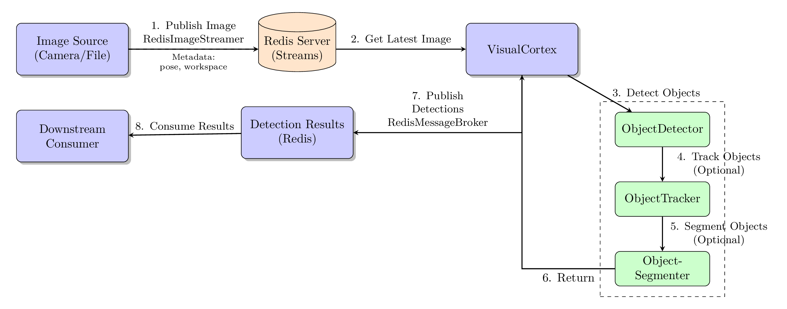

# vision_detect_segment

**A flexible Python package for real-time object detection and segmentation with Redis-based streaming support**


[](https://opensource.org/licenses/MIT)
[](https://codecov.io/gh/dgaida/vision_detect_segment)
[](https://github.com/dgaida/vision_detect_segment/actions/workflows/lint.yml)
[](https://github.com/dgaida/vision_detect_segment/actions/workflows/tests.yml)
[](https://github.com/dgaida/vision_detect_segment/actions/workflows/codeql.yml)
[](https://github.com/psf/black)
[](https://github.com/astral-sh/ruff)

---

## Overview

Designed for robotics applications, this package provides an easy-to-use interface for detecting and segmenting objects in images using state-of-the-art vision models. It seamlessly integrates with Redis streams for real-time image processing and detection result streaming.

### Key Features

- 🎯 **Multiple Detection Backends** - Support for OWL-V2, YOLO-World, YOLOE, and Grounding-DINO
- 🎭 **Optional Segmentation** - Integrated support for SAM2, FastSAM, and YOLOE's built-in segmentation
- 📡 **Redis Streaming** - Built-in Redis support for real-time image streaming and detection results
- ⚙️ **Flexible Configuration** - Easy-to-use configuration system with sensible defaults
- 🚀 **GPU Support** - Automatic GPU detection and utilization when available
- 🛡️ **Robust Error Handling** - Comprehensive exception handling with detailed error messages
- 📊 **Performance Monitoring** - Built-in timing and memory usage tracking
- 🔄 **Object Tracking** - Persistent object IDs across frames with label stabilization

---

## What's New: YOLOE Support

YOLOE (Real-Time Seeing Anything) is the latest addition to our supported models, offering:

- **Unified Detection & Segmentation** - Single model for both tasks
- **Open-Vocabulary Detection** - Detect custom object classes without retraining
- **Multiple Prompting Modes** - Text prompts, visual prompts, or prompt-free with 1200+ built-in classes
- **Real-Time Performance** - Comparable speed to YOLO11 (~130 FPS on GPU)
- **Superior Accuracy** - Improved performance over YOLO-Worldv2

---

## Supported Models

### Object Detection Models

| Model | Description | Best For | Speed | Segmentation |
|-------|-------------|----------|-------|--------------|
| **yoloe-11s/m/l** | Open-vocabulary detection & segmentation | Real-time unified tasks | Fast | Built-in ✅ |
| **yoloe-v8s/m/l** | YOLOE based on YOLOv8 | Balanced performance | Fast | Built-in ✅ |
| **yoloe-*-pf** | Prompt-free variants | Large vocabulary (1200+ classes) | Fast | Built-in ✅ |
| **yolo-world** | Real-time detection | Speed-critical applications | Fast | External |
| **owlv2** | Open-vocabulary detection | Custom object classes | Medium | External |
| **grounding_dino** | Text-guided detection | Complex queries | Slow | External |

### Segmentation Models

| Model | Description | Requirements |
|-------|-------------|--------------|
| **YOLOE (Built-in)** | Integrated segmentation | Ultralytics ≥8.3.0 |
| **FastSAM** | Fast segmentation | Included with ultralytics |
| **SAM2** | High-quality segmentation | `pip install segment-anything-2` |

---

## Installation

### Prerequisites

- Python ≥ 3.8
- Redis Server ≥ 5.0

### Basic Installation

```bash
git clone https://github.com/dgaida/vision_detect_segment.git
cd vision_detect_segment
pip install -e .
```

### Dependencies

Core dependencies:
```bash
pip install torch torchvision
pip install opencv-python numpy
pip install supervision
pip install redis
```

Model-specific dependencies:

```bash
# For OWL-V2 and Grounding-DINO
pip install transformers

# For YOLO-World and YOLOE
pip install -U ultralytics>=8.3.0

# For SAM2 segmentation (optional)
pip install git+https://github.com/facebookresearch/segment-anything-2.git
```

### Redis Server

```bash
# Using Docker (recommended)
docker run -p 6379:6379 redis:alpine

# Or install locally
# Ubuntu/Debian:
sudo apt-get install redis-server

# macOS:
brew install redis
```

---

## Quick Start

### Basic Usage

```python
from vision_detect_segment import VisualCortex, get_default_config
from redis_robot_comm import RedisImageStreamer
import cv2

# Initialize with test configuration
config = get_default_config("owlv2")
cortex = VisualCortex("owlv2", device="auto", config=config)

# Load an image
image = cv2.imread("example.jpg")

# Publish to Redis
streamer = RedisImageStreamer(stream_name="robot_camera")
streamer.publish_image(image, metadata={"source": "camera1"})

# Get detection results
success = cortex.detect_objects_from_redis()
if success:
    detected_objects = cortex.get_detected_objects()
    annotated_image = cortex.get_annotated_image()

    # Display results
    cv2.imshow("Detections", annotated_image)
    cv2.waitKey(0)
```

### Using YOLOE for Detection and Segmentation

```python
from vision_detect_segment import VisualCortex, get_default_config
import cv2

# Initialize with YOLOE (built-in segmentation)
config = get_default_config("yoloe-11l")
cortex = VisualCortex("yoloe-11l", device="auto", config=config)

# Load and publish image
image = cv2.imread("example.jpg")
streamer.publish_image(image)

# Detect objects (includes segmentation automatically)
if cortex.detect_objects_from_redis():
    detected_objects = cortex.get_detected_objects()

    # Check if segmentation masks are available
    for obj in detected_objects:
        print(f"Object: {obj['label']}, Has mask: {obj.get('has_mask', False)}")

    # Display annotated image with segmentation
    cv2.imshow("Detections", cortex.get_annotated_image())
    cv2.waitKey(0)
```

### Using Custom Object Labels

```python
from vision_detect_segment import VisualCortex, VisionConfig

# Create custom configuration
config = VisionConfig()
config.set_object_labels([
    "red cube", "blue sphere", "green cylinder",
    "robot gripper", "workpiece"
])

cortex = VisualCortex("owlv2", config=config)
```

### Running the Test Script

```bash
# Make sure Redis is running
docker run -p 6379:6379 redis:alpine

# In another terminal, run the test script
python main.py
```

---

## Configuration

### Using Configuration Objects

```python
from vision_detect_segment import VisionConfig, get_default_config

# Get default configuration for a model
config = get_default_config("owlv2")

# Customize settings
config.model.confidence_threshold = 0.25
config.model.max_detections = 30
config.redis.host = "localhost"
config.redis.port = 6379
config.annotation.show_confidence = True
config.annotation.resize_scale_factor = 2.0
config.enable_segmentation = True
config.verbose = True

# Use with VisualCortex
cortex = VisualCortex("owlv2", config=config)
```

### Test Configuration

For faster testing with fewer object labels:

```python
from vision_detect_segment.config import create_test_config

config = create_test_config()  # Only 7 labels instead of 50+
cortex = VisualCortex("owlv2", config=config)
```

---

## Architecture

### Workflow Overview



The system follows a producer-consumer architecture:

1. **Image Publishing** - Images are published to Redis with metadata
2. **Image Retrieval** - VisualCortex retrieves latest images
3. **Object Detection** - Multi-model detection engine processes images
4. **Object Tracking** (Optional) - Maintains persistent object IDs
5. **Instance Segmentation** (Optional) - Generates pixel-level masks
6. **Results Publishing** - Detections published back to Redis
7. **Visualization** - Annotated images for debugging and monitoring

For detailed workflow documentation, see **[docs/vision_workflow_doc.md](docs/vision_workflow_doc.md)**

### Key Components

- **VisualCortex** - Main orchestrator that coordinates all processing steps
- **ObjectDetector** - Multi-model detection engine with tracking support
- **ObjectTracker** - Persistent object tracking with label stabilization
- **ObjectSegmenter** - Instance segmentation using SAM2, FastSAM, or YOLOE
- **RedisImageStreamer** - Image publishing and retrieval (from `redis_robot_comm`)
- **RedisMessageBroker** - Detection results publishing (from `redis_robot_comm`)

---

## Performance

### Typical Processing Times (NVIDIA GPU)

| Model | Detection | Segmentation | Total FPS |
|-------|-----------|--------------|-----------|
| YOLOE-L | 6-10ms | Built-in | 100-160 FPS |
| YOLO-World | 20-50ms | 50-100ms (FastSAM) | 10-25 FPS |
| OWL-V2 | 100-200ms | 200-500ms (SAM2) | 1-3 FPS |
| Grounding-DINO | 200-400ms | 200-500ms (SAM2) | 1-2 FPS |

### Performance Optimization Tips

```python
# 1. Use faster models
cortex = VisualCortex("yoloe-11l", device="cuda")  # Fastest

# 2. Reduce object labels
config.set_object_labels(["red cube", "blue sphere"])

# 3. Disable segmentation if not needed
config.enable_segmentation = False

# 4. Adjust confidence threshold
config.model.confidence_threshold = 0.5  # Higher = fewer detections

# 5. Clear GPU cache regularly
cortex.clear_cache()

# 6. Use JPEG compression for images
streamer.publish_image(image, compress_jpeg=True, quality=70)
```

---

## Advanced Features

### Object Tracking

```python
from vision_detect_segment import VisualCortex

# Tracking is enabled by default
cortex = VisualCortex("owlv2", device="auto")

# Process multiple frames
for frame in video_frames:
    streamer.publish_image(frame)
    cortex.detect_objects_from_redis()

    # Track IDs persist across frames
    for obj in cortex.get_detected_objects():
        if "track_id" in obj:
            print(f"Object {obj['label']} has track ID: {obj['track_id']}")
```

### Label Stabilization

The tracker includes progressive label stabilization:
- Labels shown from first frame using majority vote
- Stabilized after N frames (default: 10)
- Prevents flickering between similar classes

### Publishing Annotated Frames

```python
# Enable annotated frame publishing
cortex = VisualCortex(
    "owlv2",
    annotated_stream_name="annotated_camera",
    publish_annotated=True
)

# Annotated frames automatically published to Redis
# View with: python scripts/visualize_annotated_frames.py
```

### Dynamic Label Management

```python
from redis_robot_comm import RedisLabelManager

# Initialize label manager
label_mgr = RedisLabelManager()

# Add new detectable object
cortex.add_detectable_object("new_object")

# Get current labels
labels = cortex.get_object_labels()
print(f"Detectable objects: {labels}")
```

---

## API Reference

### VisualCortex

```python
cortex = VisualCortex(
    objdetect_model_id: str,          # "owlv2", "yolo-world", "yoloe-11l", etc.
    device: str = "auto",              # "auto", "cuda", or "cpu"
    stream_name: str = "robot_camera", # Redis stream name for input
    annotated_stream_name: str = "annotated_camera",
    publish_annotated: bool = True,
    verbose: bool = False,
    config: Optional[VisionConfig] = None
)
```

**Key Methods:**

| Method | Description | Returns |
|--------|-------------|---------|
| `detect_objects_from_redis()` | Trigger detection from Redis | bool |
| `get_detected_objects()` | Get list of detected objects | List[Dict] |
| `get_annotated_image()` | Get annotated visualization | np.ndarray |
| `get_current_image()` | Get current raw image | np.ndarray |
| `add_detectable_object(label)` | Add new object label | None |
| `get_stats()` | Get processing statistics | Dict |
| `clear_cache()` | Clear GPU memory cache | None |

### Detection Results Format

```python
detected_object = {
    "label": str,              # Object class name
    "confidence": float,       # Detection confidence (0-1)
    "bbox": {                  # Bounding box coordinates
        "x_min": int,
        "y_min": int,
        "x_max": int,
        "y_max": int
    },
    "track_id": int,           # Optional tracking ID
    "has_mask": bool,          # Whether segmentation mask available
    "mask_data": str,          # Base64-encoded mask (if available)
    "mask_shape": List[int],   # Mask dimensions [height, width]
    "mask_dtype": str          # Mask data type
}
```

For complete API documentation, see **[docs/api.md](docs/api.md)**

---

## Use Cases

### 1. Real-Time Robotics

```python
# Perfect for robot manipulation tasks
config = get_default_config("yoloe-11m")
config.set_object_labels(["workpiece", "tool", "gripper"])
cortex = VisualCortex("yoloe-11m", config=config)
```

### 2. Quality Inspection

```python
# Fast detection and segmentation of defects
config = get_default_config("yoloe-11s")
config.set_object_labels(["scratch", "dent", "crack", "discoloration"])
cortex = VisualCortex("yoloe-11s", config=config)
```

### 3. Warehouse Automation

```python
# Track and segment various package types
config = get_default_config("yolo-world")
config.set_object_labels(["box", "pallet", "container", "forklift"])
cortex = VisualCortex("yolo-world", config=config)
```

### 4. Custom Object Detection

```python
# Open-vocabulary detection for custom classes
config = get_default_config("owlv2")
config.set_object_labels(["your", "custom", "objects"])
cortex = VisualCortex("owlv2", config=config)
```

---

## Troubleshooting

### Common Issues

**Redis Connection Failed**
```bash
# Check if Redis is running
docker ps | grep redis

# Or start Redis
docker run -p 6379:6379 redis:alpine
```

**CUDA Out of Memory**
```python
# Use CPU instead
cortex = VisualCortex("owlv2", device="cpu")

# Or clear cache regularly
cortex.clear_cache()

# Or use smaller model
cortex = VisualCortex("yoloe-11s", device="cuda")
```

**Model Loading Fails**
```bash
# Check dependencies
pip install transformers  # For OWL-V2/Grounding-DINO
pip install -U ultralytics>=8.3.0  # For YOLO-World/YOLOE
```

**No Objects Detected**
```python
# Lower confidence threshold
config.model.confidence_threshold = 0.1

# Check object labels
config.set_object_labels(["expected", "objects"])

# Verify image quality
cv2.imshow("Input", image)
```

For more troubleshooting information, see **[docs/vision_workflow_doc.md](docs/vision_workflow_doc.md#troubleshooting)**

---

## Project Structure

```
vision_detect_segment/
├── .github/workflows/        # CI/CD pipelines
├── docs/                     # Documentation
│   ├── README.md
│   ├── api.md
│   ├── vision_workflow_doc.md
│   └── *.png
├── examples/
│   └── example.png
├── scripts/
│   └── detect_objects_publish_annotated_frames.py
├── tests/                    # Comprehensive test suite
│   ├── test_config.py
│   ├── test_detector.py
│   ├── test_segmenter.py
│   ├── test_tracker.py
│   ├── test_utils.py
│   ├── test_visualcortex.py
│   └── integration/
├── vision_detect_segment/
│   ├── __init__.py
│   ├── core/
│   │   ├── object_detector.py
│   │   ├── object_segmenter.py
│   │   ├── object_tracker.py
│   │   └── visualcortex.py
│   └── utils/
│       ├── config.py
│       ├── exceptions.py
│       └── utils.py
├── main.py                   # Test script
├── README.md
├── pyproject.toml
└── requirements.txt
```

---

## Testing

```bash
# Run comprehensive test suite
python main.py

# Run unit tests
pytest tests/ -v

# Run with coverage
pytest tests/ --cov=vision_detect_segment --cov-report=html

# View coverage report
open htmlcov/index.html
```

---

## Development

### Code Quality

```bash
# Install development dependencies
pip install -r requirements-test.txt

# Linting
ruff check . --fix

# Formatting
black .

# Type checking
mypy vision_detect_segment --ignore-missing-imports

# Security scanning
bandit -r vision_detect_segment/ -ll
```

### Pre-Commit Hooks

```bash
pip install pre-commit
pre-commit install
```

---

## Contributing

Contributions are welcome! Please ensure:

- Code follows existing style conventions
- Private variables use `_` prefix
- New features include error handling
- Tests pass successfully
- Documentation is updated

---

## License

MIT License - see [LICENSE](LICENSE) file for details

---

## Citation

If you use this package in your research, please cite:

```bibtex
@software{vision_detect_segment,
  author = {Gaida, Daniel},
  title = {vision_detect_segment: Object Detection and Segmentation for Robotics},
  year = {2025},
  url = {https://github.com/dgaida/vision_detect_segment}
}
```

---

## Acknowledgments

This package builds upon:
- [Supervision](https://github.com/roboflow/supervision) - Annotation framework
- [Transformers](https://github.com/huggingface/transformers) - OWL-V2 and Grounding-DINO models
- [Ultralytics](https://github.com/ultralytics/ultralytics) - YOLO-World, YOLOE, and FastSAM
- [SAM2](https://github.com/facebookresearch/segment-anything-2) - High-quality segmentation
- [YOLOE](https://github.com/THU-MIG/yoloe) - Open-vocabulary detection and segmentation

---

## Related Projects

- **[redis_robot_comm](https://github.com/dgaida/redis_robot_comm)** - Redis-based communication for robotics
- **[robot_environment](https://github.com/dgaida/robot_environment)** - Robot control with visual object recognition
- **[robot_mcp](https://github.com/dgaida/robot_mcp)** - LLM-based robot control using MCP

---

## Contact

**Daniel Gaida**  
Email: daniel.gaida@th-koeln.de  
GitHub: [@dgaida](https://github.com/dgaida)

Project Link: https://github.com/dgaida/vision_detect_segment
