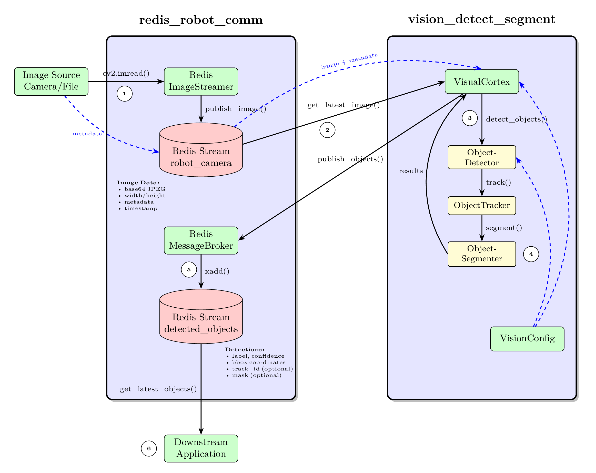

# Vision Detection Workflow Documentation

## Overview

This document describes the complete workflow of the `vision_detect_segment` package in conjunction with the `redis_robot_comm` package. The system provides a complete pipeline for real-time object detection, tracking, and segmentation in robotics applications using Redis as a communication backbone.

## Table of Contents

- [Architecture Overview](#architecture-overview)
- [Workflow Steps](#workflow-steps)
- [Component Details](#component-details)
- [Code Examples](#code-examples)
- [Performance Considerations](#performance-considerations)
- [Troubleshooting](#troubleshooting)

---

## Architecture Overview

The vision detection system follows a producer-consumer architecture with Redis Streams as the communication layer:

```
┌─────────────────┐         ┌─────────────────┐         ┌─────────────────┐
│                 │         │                 │         │                 │
│  Image Source   │────────▶│  Redis Server   │────────▶│  VisualCortex   │
│  (Camera/File)  │         │  (Stream Broker)│         │  (Detector)     │
│                 │         │                 │         │                 │
└─────────────────┘         └─────────────────┘         └─────────────────┘
        │                           ▲                            │
        │                           │                            │
        │                           │                            ▼
        │                           │                    ┌─────────────────┐
        │                           │                    │                 │
        │                           └────────────────────│  Detections     │
        │                                                │  (Results)      │
        │                                                │                 │
        └────────────────────────────────────────────────▶ └─────────────────┘
                    (Metadata: pose, workspace_id, etc.)
```

### Key Components

1. **RedisImageStreamer** (from `redis_robot_comm`)
   - Publishes images to Redis streams
   - Handles variable image sizes
   - Supports JPEG compression
   - Manages stream metadata

2. **VisualCortex** (from `vision_detect_segment`)
   - Main orchestration class
   - Consumes images from Redis
   - Coordinates detection, tracking, and segmentation
   - Publishes results back to Redis

3. **ObjectDetector**
   - Multi-model backend support (OWL-V2, YOLO-World, Grounding-DINO)
   - Real-time object detection
   - Confidence-based filtering

4. **ObjectTracker**
   - Persistent object tracking across frames
   - Track ID assignment
   - YOLO built-in tracking or ByteTrack for transformer models

5. **ObjectSegmenter**
   - Optional instance segmentation
   - SAM2 or FastSAM backend
   - Mask generation for detected objects

6. **RedisMessageBroker** (from `redis_robot_comm`)
   - Publishes detection results
   - Stores object metadata
   - Enables downstream consumers

---



---

## Workflow Steps

### Step 1: Image Capture and Publishing

The workflow begins when an image source (camera, file, or simulation) captures a frame and publishes it to Redis.

```python
from redis_robot_comm import RedisImageStreamer
import cv2
import time

# Initialize streamer
streamer = RedisImageStreamer(
    host="localhost",
    port=6379,
    stream_name="robot_camera"
)

# Capture image
image = cv2.imread("workspace.jpg")  # or cv2.VideoCapture(0).read()

# Prepare metadata
metadata = {
    "robot": "robot_arm_1",
    "workspace": "assembly_station_A",
    "workspace_id": "ws_001",
    "robot_pose": {
        "x": 0.0, "y": 0.0, "z": 0.5,
        "roll": 0.0, "pitch": 0.0, "yaw": 0.0
    },
    "frame_id": 1,
    "timestamp": time.time()
}

# Publish to Redis
stream_id = streamer.publish_image(
    image,
    metadata=metadata,
    compress_jpeg=True,
    quality=85,
    maxlen=5  # Keep only last 5 frames
)

print(f"Published image with ID: {stream_id}")
```

**Redis Stream Entry:**
```
Stream: "robot_camera"
Entry ID: "1699564231000-0"
Fields:
  - timestamp: "1699564231.123456"
  - image_data: "<base64_encoded_jpeg>"
  - format: "jpeg"
  - width: "1920"
  - height: "1080"
  - channels: "3"
  - dtype: "uint8"
  - compressed_size: "245678"
  - original_size: "6220800"
  - metadata: "{...}"
```

---

### Step 2: Image Retrieval by VisualCortex

The `VisualCortex` class monitors the Redis stream and retrieves images for processing.

```python
from vision_detect_segment import VisualCortex
from vision_detect_segment.config import create_test_config

# Initialize VisualCortex
config = create_test_config()
cortex = VisualCortex(
    objdetect_model_id="owlv2",
    device="auto",
    stream_name="robot_camera",
    verbose=True,
    config=config
)

# Manually trigger detection on latest image
success = cortex.detect_objects_from_redis()

if success:
    print("Detection completed successfully")
else:
    print("No image available or detection failed")
```

**Internal Process:**
1. `RedisImageStreamer.get_latest_image()` retrieves newest frame
2. Image is decoded from base64/JPEG
3. Metadata is extracted
4. Image validation is performed
5. Processing callback is triggered

---

### Step 3: Object Detection

Once an image is retrieved, the `ObjectDetector` performs detection using the configured model.

```python
# Inside VisualCortex.process_image_callback()
detected_objects = self._object_detector.detect_objects(
    image,
    confidence_threshold=0.3
)
```

**Detection Process:**

#### For Transformer-based Models (OWL-V2, Grounding-DINO):

```python
# Prepare inputs
inputs = processor(
    images=image,
    text=object_labels,
    return_tensors="pt"
).to(device)

# Run inference
with torch.no_grad():
    outputs = model(**inputs)

# Post-process
results = processor.post_process_object_detection(
    outputs=outputs,
    target_sizes=[(height, width)],
    threshold=0.3
)
```

#### For YOLO-World:

```python
# Run detection/tracking
if tracking_enabled:
    results = model.track(
        image,
        persist=True,
        conf=0.25,
        max_det=20
    )
else:
    results = model.predict(
        image,
        conf=0.25,
        max_det=20
    )
```

**Detection Output:**
```python
detected_objects = [
    {
        "label": "red cube",
        "confidence": 0.95,
        "bbox": {
            "x_min": 100,
            "y_min": 150,
            "x_max": 200,
            "y_max": 250
        },
        "has_mask": False,
        "track_id": 1  # Only if tracking enabled
    },
    {
        "label": "blue circle",
        "confidence": 0.87,
        "bbox": {
            "x_min": 300,
            "y_min": 180,
            "x_max": 380,
            "y_max": 260
        },
        "has_mask": False,
        "track_id": 2
    }
]
```

---

### Step 4: Object Tracking (Optional)

If tracking is enabled, the `ObjectTracker` maintains persistent IDs across frames.

```python
# For YOLO models - built-in tracking
if self._use_yolo_tracker and self.enable_tracking:
    results = self.model.track(
        image,
        persist=True,  # Maintain IDs across frames
        stream=False,
        conf=threshold,
        max_det=max_det
    )
    # Extract track IDs from results
    if hasattr(results[0].boxes, "id"):
        track_ids = results[0].boxes.id.cpu().numpy().astype(int)

# For transformer models - ByteTrack
if self._tracker and self.enable_tracking:
    detections = sv.Detections(
        xyxy=boxes.cpu().numpy(),
        confidence=scores.cpu().numpy(),
        class_id=class_ids
    )
    tracked_detections = self._tracker.update_with_detections(detections)
    track_ids = tracked_detections.tracker_id
```

**Tracking Benefits:**
- Consistent object identity across frames
- Motion trajectory analysis
- Object persistence through occlusions
- Improved downstream processing (counting, monitoring, etc.)

**Example with Track IDs:**
```python
detected_objects = [
    {
        "label": "red cube",
        "confidence": 0.95,
        "bbox": {...},
        "track_id": 1  # Same ID as previous frame
    },
    {
        "label": "blue circle",
        "confidence": 0.87,
        "bbox": {...},
        "track_id": 2  # Newly appeared object
    }
]
```

---

### Step 5: Instance Segmentation (Optional)

If segmentation is enabled, the `ObjectSegmenter` generates pixel-level masks for each detection.

```python
# For each detected object
for obj, box in zip(detected_objects, boxes):
    # Generate mask
    mask_8u, mask_binary = segmenter.segment_box_in_image(
        box,
        image
    )
    
    if mask_8u is not None:
        # Serialize mask for Redis
        obj["mask_data"] = base64.b64encode(mask_8u.tobytes()).decode('utf-8')
        obj["has_mask"] = True
        obj["mask_shape"] = list(mask_8u.shape)
        obj["mask_dtype"] = str(mask_8u.dtype)
```

**Segmentation Models:**

#### SAM2 (Segment Anything Model 2):
- High-quality segmentation
- Better boundary precision
- Slower inference (~200ms per object)

```python
segmenter = ObjectSegmenter(
    segmentation_model="facebook/sam2.1-hiera-tiny",
    device="cuda"
)
```

#### FastSAM:
- Real-time segmentation
- Good for time-critical applications
- Faster inference (~50ms per object)

```python
segmenter = ObjectSegmenter(
    segmentation_model=None,  # Auto-selects FastSAM
    device="cuda"
)
```

**Segmented Object:**
```python
{
    "label": "red cube",
    "confidence": 0.95,
    "bbox": {...},
    "track_id": 1,
    "has_mask": True,
    "mask_data": "<base64_encoded_mask>",
    "mask_shape": [100, 100],  # [height, width]
    "mask_dtype": "uint8"
}
```

---

### Step 6: Publishing Results to Redis

After detection, tracking, and optional segmentation, results are published back to Redis.

```python
# Inside ObjectDetector._publish_detections()
metadata = {
    'timestamp': time.time(),
    'object_count': len(detected_objects),
    'detection_method': 'owlv2',
    'model_id': 'owlv2'
}

redis_broker.publish_objects(
    detected_objects,
    metadata
)
```

**Redis Stream Entry:**
```
Stream: "detected_objects"
Entry ID: "1699564231500-0"
Fields:
  - timestamp: "1699564231.234567"
  - objects: "[{...}, {...}]"  # JSON array of detected objects
  - camera_pose: "{...}"
```

---

### Step 7: Annotation and Visualization

The `VisualCortex` creates annotated images for visualization and debugging.

```python
# Get results
annotated_image = cortex.get_annotated_image()
detected_objects = cortex.get_detected_objects()

# Display
cv2.imshow("Detections", annotated_image)
cv2.waitKey(0)

# Print summary
for obj in detected_objects:
    print(f"Found {obj['label']} with confidence {obj['confidence']:.2f}")
    if 'track_id' in obj:
        print(f"  Track ID: {obj['track_id']}")
```

**Annotation Features:**
- Bounding boxes with corner markers
- Labels with confidence scores
- Track IDs (if tracking enabled)
- Segmentation masks with halo effect
- Configurable colors and styles

---

## Component Details

### VisualCortex

The main orchestrator that coordinates all components.

**Key Methods:**
- `detect_objects_from_redis()` - Manually trigger detection
- `get_detected_objects()` - Retrieve detection results
- `get_annotated_image()` - Get visualization
- `get_current_image()` - Get raw input image
- `add_detectable_object(label)` - Add new object type
- `get_stats()` - Get processing statistics

**Configuration:**
```python
from vision_detect_segment.config import VisionConfig

config = VisionConfig()

# Model settings
config.model.confidence_threshold = 0.3
config.model.max_detections = 20

# Redis settings
config.redis.host = "localhost"
config.redis.port = 6379
config.redis.stream_name = "robot_camera"

# Annotation settings
config.annotation.show_confidence = True
config.annotation.resize_scale_factor = 2.0

# Object labels
config.set_object_labels([
    "red cube", "blue sphere", "green cylinder",
    "robot gripper", "workpiece"
])
```

---

### ObjectDetector

Handles multi-model object detection.

**Supported Models:**

| Model | Backend | Speed | Use Case |
|-------|---------|-------|----------|
| **owlv2** | Transformers | Medium | Open-vocabulary detection |
| **yolo-world** | Ultralytics | Fast | Real-time applications |
| **grounding_dino** | Transformers | Slow | Complex text queries |

**Key Methods:**
- `detect_objects(image, threshold)` - Run detection
- `add_label(label)` - Add detectable object
- `get_detections()` - Get supervision detections
- `get_label_texts()` - Get detection labels with track IDs

---

### ObjectTracker

Maintains object identity across frames.

**Tracking Strategies:**

1. **YOLO Built-in Tracking:**
   - Uses Ultralytics' native tracker
   - Optimized for YOLO models
   - `persist=True` maintains IDs

2. **ByteTrack (Transformer Models):**
   - Supervision's ByteTrack implementation
   - Works with OWL-V2 and Grounding-DINO
   - Robust to occlusions

**Configuration:**
```python
cortex = VisualCortex(
    objdetect_model_id="owlv2",
    config=config
)

# Tracking is enabled via ObjectDetector initialization
detector = ObjectDetector(
    device="cuda",
    model_id="owlv2",
    object_labels=labels,
    enable_tracking=True  # Enable tracking
)
```

---

### ObjectSegmenter

Generates instance segmentation masks.

**Key Methods:**
- `segment_objects(image, detections)` - Segment all detections
- `segment_box_in_image(box, image)` - Segment single object
- `is_available()` - Check if segmentation is available

**Mask Format:**
```python
# uint8 mask (0-255)
mask_8u = np.array([[0, 0, 255, 255],
                    [0, 255, 255, 255],
                    [255, 255, 255, 0],
                    [255, 255, 0, 0]], dtype=np.uint8)

# Binary mask (True/False)
mask_binary = mask_8u > 0
```

---

## Code Examples

### Complete End-to-End Example

```python
import cv2
import time
from vision_detect_segment import VisualCortex
from vision_detect_segment.config import create_test_config
from redis_robot_comm import RedisImageStreamer

# 1. Initialize components
streamer = RedisImageStreamer(stream_name="robot_camera")
config = create_test_config()
cortex = VisualCortex(
    objdetect_model_id="owlv2",
    device="auto",
    config=config
)

# 2. Publish image
image = cv2.imread("workspace.jpg")
metadata = {
    "robot": "arm1",
    "workspace": "station_A",
    "timestamp": time.time()
}
streamer.publish_image(image, metadata=metadata)

# 3. Wait for Redis
time.sleep(0.5)

# 4. Detect objects
success = cortex.detect_objects_from_redis()

if success:
    # 5. Get results
    detected_objects = cortex.get_detected_objects()
    annotated_image = cortex.get_annotated_image()
    
    # 6. Display
    print(f"Found {len(detected_objects)} objects:")
    for obj in detected_objects:
        print(f"  - {obj['label']}: {obj['confidence']:.2f}")
        if 'track_id' in obj:
            print(f"    Track ID: {obj['track_id']}")
    
    cv2.imshow("Detections", annotated_image)
    cv2.waitKey(0)
```

---

### Continuous Processing Loop

```python
import cv2
import time
from vision_detect_segment import VisualCortex
from redis_robot_comm import RedisImageStreamer

# Initialize
streamer = RedisImageStreamer()
cortex = VisualCortex("yolo-world", device="cuda")

# Open camera
cap = cv2.VideoCapture(0)

try:
    while True:
        # Capture frame
        ret, frame = cap.read()
        if not ret:
            break
        
        # Publish to Redis
        streamer.publish_image(
            frame,
            metadata={"frame": cap.get(cv2.CAP_PROP_POS_FRAMES)}
        )
        
        # Detect objects
        if cortex.detect_objects_from_redis():
            # Show results
            annotated = cortex.get_annotated_image()
            cv2.imshow("Detections", annotated)
        
        # Break on 'q'
        if cv2.waitKey(1) & 0xFF == ord('q'):
            break
        
        time.sleep(0.033)  # ~30 FPS

finally:
    cap.release()
    cv2.destroyAllWindows()
```

---

### Processing Pre-recorded Video

```python
import cv2
from vision_detect_segment import VisualCortex
from redis_robot_comm import RedisImageStreamer

streamer = RedisImageStreamer()
cortex = VisualCortex("owlv2", device="cuda")

# Open video file
cap = cv2.VideoCapture("recording.mp4")
frame_count = 0

while cap.isOpened():
    ret, frame = cap.read()
    if not ret:
        break
    
    frame_count += 1
    
    # Publish every 10th frame
    if frame_count % 10 == 0:
        streamer.publish_image(frame)
        
        if cortex.detect_objects_from_redis():
            objects = cortex.get_detected_objects()
            print(f"Frame {frame_count}: {len(objects)} objects")

cap.release()
```

---

## Performance Considerations

### Throughput Optimization

**1. Model Selection:**
```python
# Fast (30+ FPS on GPU)
cortex = VisualCortex("yolo-world", device="cuda")

# Medium (10-15 FPS on GPU)
cortex = VisualCortex("owlv2", device="cuda")

# Slow (3-5 FPS on GPU)
cortex = VisualCortex("grounding_dino", device="cuda")
```

**2. Image Compression:**
```python
# High compression (faster, smaller)
streamer.publish_image(image, compress_jpeg=True, quality=70)

# Low compression (slower, better quality)
streamer.publish_image(image, compress_jpeg=True, quality=95)

# No compression (slowest, lossless)
streamer.publish_image(image, compress_jpeg=False)
```

**3. Reduce Object Labels:**
```python
# Fewer labels = faster detection
config = VisionConfig()
config.set_object_labels([
    "red cube", "blue sphere"  # Only 2 labels
])
```

**4. Disable Segmentation:**
```python
config = VisionConfig()
config.enable_segmentation = False  # Skip segmentation
```

**5. Adjust Confidence Threshold:**
```python
# Higher threshold = fewer detections = faster post-processing
config.model.confidence_threshold = 0.5  # Default: 0.3
```

---

### Memory Management

**Clear GPU Cache:**
```python
cortex.clear_cache()  # Clear PyTorch CUDA cache
```

**Monitor Memory:**
```python
memory_info = cortex.get_memory_usage()
print(f"Memory: {memory_info['rss_mb']:.1f} MB")
```

**Limit Redis Stream Size:**
```python
streamer.publish_image(image, maxlen=5)  # Keep only last 5 frames
```

---

### Latency Optimization

**End-to-end latency breakdown:**

| Component | Typical Latency | Notes |
|-----------|----------------|-------|
| Image encoding | 5-20 ms | Depends on JPEG quality |
| Redis publish | <1 ms | Local network |
| Redis retrieve | <1 ms | Local network |
| Image decoding | 5-20 ms | Depends on image size |
| Detection (YOLO) | 20-50 ms | GPU-dependent |
| Detection (OWL-V2) | 100-200 ms | GPU-dependent |
| Segmentation (FastSAM) | 50-100 ms | Per object |
| Segmentation (SAM2) | 200-500 ms | Per object |
| Annotation | 5-10 ms | CPU-bound |
| **Total (YOLO, no seg)** | **40-100 ms** | ~10-25 FPS |
| **Total (OWL-V2 + SAM2)** | **500-1000 ms** | ~1-2 FPS |

---

## Troubleshooting

### Common Issues

**1. Redis Connection Failed**
```
RedisConnectionError: Redis connection failed on localhost:6379
```
**Solution:**
```bash
# Start Redis server
docker run -p 6379:6379 redis:alpine

# Or check if Redis is running
redis-cli ping
```

---

**2. CUDA Out of Memory**
```
RuntimeError: CUDA out of memory
```
**Solution:**
```python
# Use CPU
cortex = VisualCortex("owlv2", device="cpu")

# Or clear cache
cortex.clear_cache()

# Or reduce image size
image = cv2.resize(image, (640, 480))
```

---

**3. No Objects Detected**
```python
detected_objects = []  # Empty
```
**Solutions:**
```python
# 1. Lower confidence threshold
config.model.confidence_threshold = 0.1

# 2. Check object labels
config.set_object_labels(["red cube", "blue sphere"])

# 3. Verify image quality
cv2.imshow("Input", image)
```

---

**4. Model Loading Failed**
```
DependencyError: Missing dependency 'transformers'
```
**Solution:**
```bash
# Install dependencies
pip install transformers  # For OWL-V2, Grounding-DINO
pip install ultralytics   # For YOLO-World
```

---

**5. Tracking IDs Inconsistent**
```python
# Track IDs change every frame
```
**Solution:**
```python
# Ensure tracking is enabled
detector = ObjectDetector(
    ...
    enable_tracking=True
)

# For YOLO, verify persist=True
results = model.track(image, persist=True)
```

---

## Best Practices

### 1. Configuration Management
```python
# Create custom config
config = VisionConfig()
config.model.confidence_threshold = 0.3
config.redis.host = "192.168.1.100"
config.verbose = True

# Save for later use
import json
config_dict = {
    "model": {
        "confidence_threshold": config.model.confidence_threshold
    }
}
with open("config.json", "w") as f:
    json.dump(config_dict, f)
```

---

### 2. Error Handling
```python
from vision_detect_segment.exceptions import (
    VisionDetectionError,
    RedisConnectionError
)

try:
    cortex = VisualCortex("owlv2")
    cortex.detect_objects_from_redis()
except RedisConnectionError as e:
    print(f"Redis error: {e}")
except VisionDetectionError as e:
    print(f"Detection error: {e}")
```

---

### 3. Logging
```python
# Enable verbose logging
cortex = VisualCortex("owlv2", verbose=True)

# Logs will show:
# - Model loading time
# - Detection timing
# - Object counts
# - Memory usage
```

---

### 4. Testing
```python
# Use test config for faster iteration
from vision_detect_segment.config import create_test_config

config = create_test_config()  # Reduced object labels
cortex = VisualCortex("owlv2", config=config)
```

---

## Summary

The `vision_detect_segment` workflow provides a complete pipeline for real-time object detection, tracking, and segmentation:

1. ✅ **Image Capture** - Redis-based streaming with compression
2. ✅ **Detection** - Multi-model support (YOLO, OWL-V2, Grounding-DINO)
3. ✅ **Tracking** - Persistent object IDs across frames
4. ✅ **Segmentation** - Optional instance masks (SAM2, FastSAM)
5. ✅ **Publishing** - Results back to Redis for downstream processing
6. ✅ **Visualization** - Annotated images for debugging

The system is designed for robotics applications requiring real-time vision processing with flexible configuration and robust error handling.
